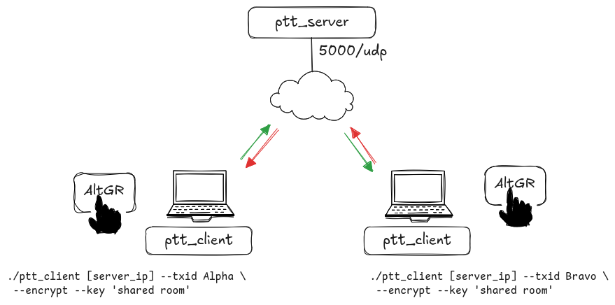
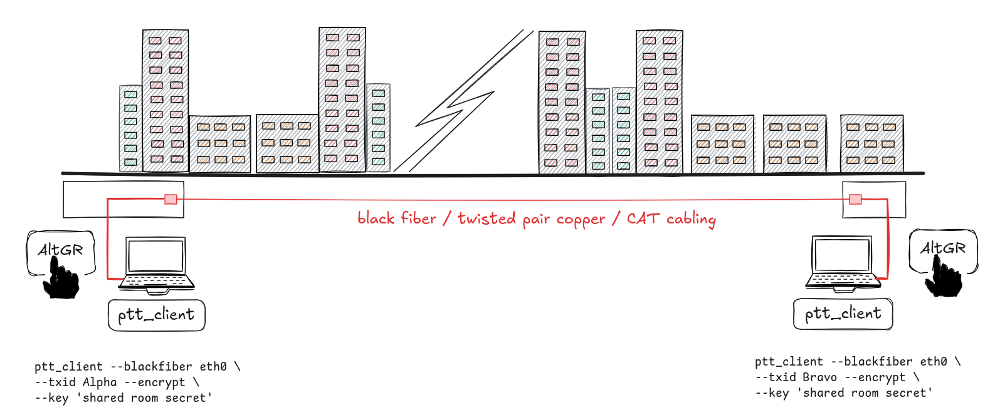
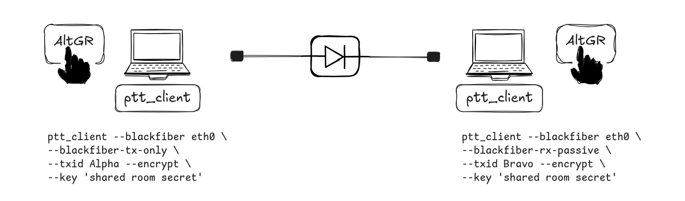

# udpptt



Simple UDP push-to-talk audio test program using a client/server model.

`udpptt` can also be used in a raw Ethernet "black fiber" mode, where clients exchange audio frames directly over a local Ethernet interface without IP addressing, routing, DHCP, or a UDP server.


## UDP connection behavior

The client keeps one UDP path continuously active by sending regular 
idle packets to the server even when no one is talking. This means the 
server always sees fresh outbound traffic from the client and can 
immediately send return audio back along the same already-active UDP 
mapping when a PTT stream becomes available. In practice, this avoids 
the need for the client to wait for a new inbound path to be 
established at the moment speech starts. A useful side effect is that 
clients usually do not need any manually opened inbound firewall or 
NAT port-forwarding rules, because the outbound UDP traffic keeps the 
return path alive for server-to-client audio delivery. This makes the 
setup much simpler for roaming laptops, home networks, and small 
embedded devices behind typical consumer routers or local firewalls.

## Black fiber / raw Ethernet behavior



In black fiber mode, `ptt_client` does not use IP or UDP. Instead, it opens a Linux raw packet socket on a selected Ethernet interface and sends the same internal `udpptt` packet format directly inside custom Ethernet frames.

This mode is intended for simple point-to-point or isolated Layer-2 links, for example:

- a direct Ethernet cable between two devices
- a private switch with only `udpptt` devices attached
- a media converter / black fiber path where no IP infrastructure is desired
- test setups where DHCP, IP addressing, routing, NAT, and firewall rules should be avoided completely

Black fiber mode is selected with:

```sh
./ptt_client --blackfiber <iface> --txid <callsign>
```

Example:

```sh
./ptt_client --blackfiber eth0 --txid Alpha --encrypt --key 'shared room secret'
```

By default, black fiber mode sends to the Ethernet broadcast MAC address:

```text
ff:ff:ff:ff:ff:ff
```

This is convenient for two-node or small isolated Layer-2 test links. You can also send to a specific destination MAC address:

```sh
./ptt_client --blackfiber eth0 \
    --bf-dst-mac 02:11:22:33:44:55 \
    --txid Alpha \
    --encrypt --key 'shared room secret'
```

The default custom Ethernet type is:

```text
0x88B5
```

You can override it if needed:

```sh
./ptt_client --blackfiber eth0 --bf-ethertype 0x88B6 --txid Alpha
```

All clients on the same black fiber segment must use the same Ethernet type. If encryption is enabled, all participating clients must also use the same room password.

Black fiber mode does not use `ptt_server`. It is direct client-to-client Layer-2 transport. The existing UDP/server mode remains unchanged and is still used when `--blackfiber` is not specified.

Packages typically needed on Debian/Ubuntu:

```sh
sudo apt install build-essential pkg-config libsodium-dev \
    libgstreamer1.0-dev libgstreamer-plugins-base1.0-dev \
    gstreamer1.0-plugins-base gstreamer1.0-plugins-good \
    gstreamer1.0-plugins-bad gstreamer1.0-tools
```

## Installation with `make install`

Build and install the binaries, tone files, and user service with:

```sh
make
sudo make install
```

The install step does the following:

- installs `ptt_client`, `ptt_server`, `ptt_helper`, and `ptt_hid` to `/usr/local/bin`
- installs `start.wav` and `stop.wav` to `/opt/udpptt`
- installs a user systemd service file to:

```text
~/.config/systemd/user/udpptt.service
```

- installs a per-user configuration file to:

```text
~/.config/udpptt/udpptt.env
```

The service is configured to run with:

```text
WorkingDirectory=/opt/udpptt
```

This means `ptt_client` will look for `start.wav` and `stop.wav` from `/opt/udpptt` when started through systemd.

After installation, enable the user service:

```sh
systemctl --user daemon-reload
systemctl --user enable --now udpptt.service
```

To view logs:

```sh
journalctl --user -u udpptt.service -f
```

## User configuration file

The runtime parameters are read from:

```text
~/.config/udpptt/udpptt.env
```

Example:

```sh
SERVER_IP=198.51.100.10
CALL_SIGN=Alpha
WORD_OF_DAY=shared-room-secret
ALTGR_PTT_DELAY_MS=2000
```

This file is intended to be edited by the user after installation. It defines the server address, callsign, encryption password, and AltGr PTT hold delay.

For black fiber mode, the service command currently needs to be adjusted manually so that it uses `--blackfiber <iface>` instead of a server IP. For example:

```ini
ExecStart=/usr/local/bin/ptt_client --blackfiber eth0 --altgr-ptt-delay-ms ${ALTGR_PTT_DELAY_MS} --txid ${CALL_SIGN} --encrypt --key ${WORD_OF_DAY}
```

## Manual installation steps and details

Build:

```sh
make
```

Run server:

```sh
./ptt_server
```

Run client in UDP/server mode:

```sh
./ptt_client <server-ip> [--txid <callsign>] [--rx-only]
./ptt_client <server-ip> [--txid <callsign>] [--no-ptt]
./ptt_client <server-ip> [--txid <callsign>] [--encrypt] [--key <password>]
UDPPTT_KEY='<password>' ./ptt_client <server-ip> [--txid <callsign>] [--encrypt]

./ptt_client <server-ip> [--codec-ptt]
./ptt_client <server-ip> [--altgr-ptt-delay-ms <ms>]
./ptt_client <server-ip> [--ptt-socket <path>]

./ptt_client <server-ip> [--rpi-audio]
./ptt_client <server-ip> [--alsa-device <device>]
./ptt_client <server-ip> [--alsa-capture-device <device>] [--alsa-playback-device <device>]
```

Run client in black fiber / raw Ethernet mode:

```sh
./ptt_client --blackfiber <iface> [--txid <callsign>]
./ptt_client --blackfiber <iface> [--txid <callsign>] [--encrypt] [--key <password>]
./ptt_client --blackfiber <iface> [--bf-dst-mac <mac>] [--bf-ethertype <ethertype>]
./ptt_client --blackfiber <iface> [--blackfiber-tx-only]
./ptt_client --blackfiber <iface> [--blackfiber-rx-passive]
./ptt_client --blackfiber <iface> [--ptt-socket <path>]
```

Examples:

```sh
./ptt_client 198.51.100.10 --txid Alpha
./ptt_client 198.51.100.10 --txid Bravo --rx-only
./ptt_client 198.51.100.10 --txid Alpha --encrypt --key 'shared room secret'
UDPPTT_KEY='shared room secret' ./ptt_client 198.51.100.10 --txid Bravo --rx-only --encrypt

./ptt_client 198.51.100.10 --txid Alpha --altgr-ptt-delay-ms 2000
./ptt_client 198.51.100.10 --txid Alpha --altgr-ptt-delay-ms 700 --encrypt --key 'shared room secret'

./ptt_client 198.51.100.10 --txid Alpha --ptt-socket /tmp/udpptt.sock --encrypt --key 'shared room secret'

./ptt_client 198.51.100.10 --txid Bravo --codec-ptt --rpi-audio --encrypt --key 'shared room secret'
./ptt_client 198.51.100.10 --txid Bravo --alsa-device plughw:0,0 --codec-ptt
./ptt_client 198.51.100.10 --txid Bravo --alsa-capture-device plughw:0,0 --alsa-playback-device plughw:0,0

./ptt_client --blackfiber eth0 --txid Alpha --encrypt --key 'shared room secret'
./ptt_client --blackfiber enp0s31f6 --txid Bravo --encrypt --key 'shared room secret'
./ptt_client --blackfiber eth0 --bf-dst-mac 02:11:22:33:44:55 --txid Alpha --encrypt --key 'shared room secret'
./ptt_client --blackfiber eth0 --bf-ethertype 0x88B6 --txid Alpha
./ptt_client --blackfiber eth0 --txid Alpha --ptt-socket /tmp/udpptt.sock --encrypt --key 'shared room secret'
```

## Notes

- In normal UDP mode, the client continuously sends UDP packets to the server from one local UDP socket.
- In black fiber mode, the client sends raw Ethernet frames directly on the selected interface.
- Each packet contains a packet type and cleartext `talk_id` header.
- When encryption is enabled, the Opus payload is encrypted end-to-end between clients.
- The `talk_id` remains visible for logging/debug, but is authenticated together with the packet.
- The UDP server does not encrypt or decrypt payloads; it only forwards packets.
- Black fiber mode does not use `ptt_server`; clients exchange frames directly at Layer 2.
- `--blackfiber-tx-only` disables the receive thread for one-way transmit-side data diode use.
- `--blackfiber-rx-passive` disables the send thread and microphone capture for one-way passive receive-side data diode use.
- Encrypted and unencrypted clients do not interoperate on the same channel.
- All encrypted clients must use the same shared password.
- The server listens on UDP/5000 and forwards only the active talker’s audio to other clients.
- A sender never gets its own audio back from the UDP server.
- In black fiber mode, locally transmitted raw frames may also be visible to the sender’s raw socket, so the client ignores frames whose source MAC address matches its own interface MAC.
- While the local client is transmitting, it suppresses playback of received audio.
- In receive mode, incoming audio debug messages show the `talk_id` of the sending party.
- The `--rx-only` and `--no-ptt` options disable keyboard PTT handling and microphone capture, but still keep the client connected for receive/playback.
- The client can optionally play local `start.wav` and `stop.wav` tones on PTT press/release if those files exist in the current working directory.
- The `--ptt-socket` option enables external PTT control through a UNIX datagram socket. This is used by `ptt_helper` and `ptt_hid`.

## PTT input modes

### PC keyboard mode

- By default, the client uses **Right Alt / AltGr** as the PTT key on normal PC hardware.
- AltGr PTT activation is delayed by a configurable hold timer.
- Default AltGr hold delay is **2000 ms**.
- This allows AltGr to still be used for normal typing, while a long press activates PTT.
- You can change the delay with:

```sh
./ptt_client <server-ip> --altgr-ptt-delay-ms 2000
```

Black fiber example:

```sh
./ptt_client --blackfiber eth0 --txid Alpha --altgr-ptt-delay-ms 2000
```

### Codec / embedded PTT mode

- The `--codec-ptt` option switches PTT input handling to **KEY_ENTER**.
- This is intended for embedded or codec-board GPIO/button input devices such as `ptt_keys`.
- In `--codec-ptt` mode, PTT activation is immediate and does not use the AltGr delay logic.

### UNIX socket PTT mode

`ptt_client` can also listen for PTT commands on a UNIX datagram socket. This allows external programs to control PTT without modifying the audio client.

Start the client with:

```sh
./ptt_client <server-ip> --ptt-socket /tmp/udpptt.sock --txid Alpha
```

Then send commands with `ptt_helper`:

```sh
./ptt_helper --socket /tmp/udpptt.sock --ptt_down
./ptt_helper --socket /tmp/udpptt.sock --ptt_up
./ptt_helper --socket /tmp/udpptt.sock --toggle
```

The socket accepts these command strings:

```text
DOWN
UP
TOGGLE
```

`ptt_helper` is mainly useful for scripts, desktop shortcuts, hardware button wrappers, and debugging.

### USB HID headset PTT mode with `ptt_hid`

`ptt_hid` is a small helper for using USB HID buttons as PTT controls. It is useful for headsets such as the Plantronics / Poly Blackwire 3225, which exposes its volume and mute buttons as Linux input events:

```text
KEY_VOLUMEUP
KEY_VOLUMEDOWN
KEY_MICMUTE
```

`ptt_hid` opens the selected `/dev/input/event*` device, uses an exclusive evdev grab, and sends PTT commands to `ptt_client` through the UNIX socket enabled by `--ptt-socket`. While `ptt_hid` is running with grabbing enabled, the desktop environment should not also receive that headset HID button event. This is useful on Wayland desktops where global media keys may otherwise change the system volume.

Start `ptt_client` with a PTT socket:

```sh
./ptt_client 198.51.100.10 \
    --ptt-socket /tmp/udpptt.sock \
    --txid Alpha \
    --encrypt --key 'shared room secret'
```

Then start `ptt_hid`:

```sh
sudo ./ptt_hid --socket /tmp/udpptt.sock --key volumeup
```

By default, `ptt_hid` looks for this Plantronics / Poly USB device:

```text
vendor  = 0x047f
product = 0xc058
```

The default HID button is `KEY_VOLUMEUP`.

#### Toggle behavior

Many headset volume buttons do not report a normal held key state. Instead, they emit short press/release pulses and may repeat those pulses while the physical button is held. Some headsets also generate their own audible beep for each volume-button pulse.

For this reason, `ptt_hid` uses toggle behavior by default:

```text
first accepted button press  -> sends DOWN
second accepted button press -> sends UP
```

A re-arm delay prevents duplicate pulses from one physical press from immediately toggling PTT back off. The default is:

```text
800 ms
```

You can change it with:

```sh
sudo ./ptt_hid --socket /tmp/udpptt.sock --key volumeup --rearm-ms 500
```

If a second intentional press is ignored, lower `--rearm-ms`. If one physical press sometimes toggles twice, increase `--rearm-ms`.

#### Auto-release timeout

`ptt_hid` also has an automatic release watchdog. If PTT is left on, it sends `UP` after a configurable number of seconds.

The default is:

```text
60 seconds
```

Example with a 30 second timeout:

```sh
sudo ./ptt_hid \
    --socket /tmp/udpptt.sock \
    --key volumeup \
    --auto-release-sec 30
```

Disable auto-release with:

```sh
sudo ./ptt_hid \
    --socket /tmp/udpptt.sock \
    --key volumeup \
    --auto-release-sec 0
```

#### Selecting keys and devices

List readable input devices:

```sh
sudo ./ptt_hid --list
```

Use a specific event device:

```sh
sudo ./ptt_hid \
    --device /dev/input/event5 \
    --socket /tmp/udpptt.sock \
    --key volumeup
```

Use another supported key:

```sh
sudo ./ptt_hid --socket /tmp/udpptt.sock --key volumedown
sudo ./ptt_hid --socket /tmp/udpptt.sock --key micmute
```

You can also match a different USB HID device by vendor and product ID:

```sh
sudo ./ptt_hid \
    --vendor 0x047f \
    --product 0xc058 \
    --socket /tmp/udpptt.sock \
    --key volumeup
```

For debugging only, grabbing can be disabled:

```sh
sudo ./ptt_hid --socket /tmp/udpptt.sock --key volumeup --no-grab
```

Without grabbing, the desktop may also receive the key event and change the system volume.

#### Typical desktop workflow

Terminal 1:

```sh
./ptt_client 198.51.100.10 \
    --ptt-socket /tmp/udpptt.sock \
    --txid Alpha \
    --encrypt --key 'shared room secret'
```

Terminal 2:

```sh
sudo ./ptt_hid \
    --socket /tmp/udpptt.sock \
    --key volumeup \
    --auto-release-sec 60
```

Press the headset Volume Up button once to start transmitting. Press it again to stop transmitting. If you forget to stop transmitting, `ptt_hid` sends PTT up automatically after the auto-release timeout.

## Audio device selection

### Default desktop mode

- If no ALSA device options are given, the client uses:
  - `autoaudiosrc` for capture
  - `autoaudiosink` for playback

This is convenient on normal desktop Linux systems.

### Raspberry Pi / explicit ALSA mode

- The client can use explicit ALSA devices for both capture and playback.
- `--rpi-audio` is a convenience option that sets both capture and playback to:

```text
plughw:0,0
```

- You can also configure them manually:
  - `--alsa-device <dev>` sets both capture and playback
  - `--alsa-capture-device <dev>` sets only capture
  - `--alsa-playback-device <dev>` sets only playback

Examples:

```sh
./ptt_client 198.51.100.10 --rpi-audio --codec-ptt --txid Bravo
./ptt_client 198.51.100.10 --alsa-device plughw:0,0 --txid Bravo
./ptt_client 198.51.100.10 --alsa-capture-device plughw:1,0 --alsa-playback-device plughw:0,0

./ptt_client --blackfiber eth0 --rpi-audio --codec-ptt --txid Bravo
./ptt_client --blackfiber eth0 --alsa-device plughw:0,0 --txid Bravo
```

This is useful on Buildroot and Raspberry Pi systems where automatic GStreamer audio sink/source selection may not work reliably.

It is also useful when testing black fiber mode with capabilities. If you run the entire program with `sudo`, desktop audio backends such as PipeWire or PulseAudio may not be available to root. Prefer running as the normal user and granting only raw Ethernet permission to the binary with `setcap`.

## Permissions

- The client scans readable `/dev/input/event*` devices for the selected PTT key.
- Membership in the `input` group is usually enough.
- On embedded targets using `--codec-ptt`, make sure the `ptt_keys` input device is accessible to the user running `ptt_client`.
- `ptt_hid` also needs read access to the selected `/dev/input/event*` device. It can be run as root for testing, or as a normal user if permissions allow.
- `ptt_hid` uses an exclusive evdev grab by default. This prevents the host desktop from also consuming the selected headset HID button while `ptt_hid` is running.

On Debian, a common approach is:

```sh
sudo usermod -aG input $USER
```

Log out and back in after changing group membership.

For a specific USB HID headset, a udev rule can be used instead of broad manual permission changes. For example, for the Plantronics / Poly device with vendor `047f` and product `c058`:

```sh
sudo tee /etc/udev/rules.d/90-udpptt-plantronics.rules >/dev/null <<'EOF'
SUBSYSTEM=="input", KERNEL=="event*", ATTRS{idVendor}=="047f", ATTRS{idProduct}=="c058", GROUP="input", MODE="0660"
EOF
sudo udevadm control --reload-rules
sudo udevadm trigger
```

Then unplug and reconnect the headset, or reboot.

### Raw Ethernet permissions for black fiber mode

Black fiber mode uses Linux raw packet sockets (`AF_PACKET`). Opening this kind of socket normally requires root or the `CAP_NET_RAW` capability.

Running the whole client with `sudo` is not recommended on desktop systems, because audio may stop working when the process runs as root. Typical symptoms include PipeWire or PulseAudio connection failures, or `autoaudiosrc` / `autoaudiosink` choosing the wrong backend.

Instead, grant only the raw socket capability to the installed binary:

```sh
sudo setcap cap_net_raw+ep /usr/local/bin/ptt_client
```

Check that the capability was applied:

```sh
getcap /usr/local/bin/ptt_client
```

Expected output:

```text
/usr/local/bin/ptt_client cap_net_raw=ep
```

Then run `ptt_client` as the normal user:

```sh
/usr/local/bin/ptt_client --blackfiber eth0 --txid Alpha --encrypt --key 'shared room secret'
```

If the interface or system policy requires additional network administration capability, you can also grant:

```sh
sudo setcap cap_net_raw,cap_net_admin+ep /usr/local/bin/ptt_client
```

Use the narrower `cap_net_raw+ep` form first unless you know `cap_net_admin` is needed.

If the binary is rebuilt or reinstalled, file capabilities may be lost and must be applied again:

```sh
sudo setcap cap_net_raw+ep /usr/local/bin/ptt_client
```

For Buildroot or embedded systems where `setcap` is not available, typical alternatives are:

- run `ptt_client` as root and force explicit ALSA devices with `--alsa-device` or `--alsa-capture-device` / `--alsa-playback-device`
- start the program from a service with only the needed capability if your init/systemd setup supports capability bounding
- configure the image to install the binary with the desired file capability

## Black fiber setup examples

### Direct cable between two clients

On client A:

```sh
./ptt_client --blackfiber eth0 --txid Alpha --encrypt --key 'shared room secret'
```

On client B:

```sh
./ptt_client --blackfiber eth0 --txid Bravo --encrypt --key 'shared room secret'
```

No IP address is needed on `eth0`.

If the Ethernet interface is down, bring it up first:

```sh
sudo ip link set eth0 up
```

### Fixed MAC destination

Broadcast is easiest, but a fixed destination MAC can be used:

On client A, send to client B:

```sh
./ptt_client --blackfiber eth0 \
    --bf-dst-mac 02:22:33:44:55:66 \
    --txid Alpha \
    --encrypt --key 'shared room secret'
```

On client B, send to client A:

```sh
./ptt_client --blackfiber eth0 \
    --bf-dst-mac 02:aa:bb:cc:dd:ee \
    --txid Bravo \
    --encrypt --key 'shared room secret'
```

You can inspect interface MAC addresses with:

```sh
ip link show eth0
```

### Explicit ALSA with black fiber

If audio backend selection is unreliable, specify ALSA devices explicitly:

```sh
./ptt_client --blackfiber eth0 \
    --txid Alpha \
    --encrypt --key 'shared room secret' \
    --alsa-capture-device plughw:0,0 \
    --alsa-playback-device plughw:0,0
```


## Data diode / one-way black fiber use



Black fiber mode can also be used across a one-way Ethernet data diode. In that design, audio is intentionally allowed to travel in only one direction.

This is useful when the physical link policy is:

```text
TX side microphone/audio source  --->  data diode  --->  RX side speaker/audio receiver
```

In this mode there is no return path. That means:

- there is no receiver acknowledgement
- there is no return audio
- there is no bidirectional PTT conversation
- there is no feedback that the receiver heard the audio
- packet loss cannot be repaired by retransmission

For live voice, this is often acceptable if the one-way Layer-2 path is clean and packet loss is low.

### Transmit side

On the transmit side of the diode, use:

```sh
--blackfiber-tx-only
```

This starts the normal transmit path but disables the receive thread. The client will send idle frames and audio frames, but it will not listen for incoming black fiber frames.

Example TX side:

```sh
./ptt_client --blackfiber eth0 \
    --blackfiber-tx-only \
    --txid TX \
    --encrypt --key 'shared room secret' \
    --alsa-capture-device plughw:0,0
```

If the transmit side also needs local playback for tones, add playback device selection too:

```sh
./ptt_client --blackfiber eth0 \
    --blackfiber-tx-only \
    --txid TX \
    --encrypt --key 'shared room secret' \
    --alsa-capture-device plughw:0,0 \
    --alsa-playback-device plughw:0,0
```

### Receive side

On the receive side of the diode, use:

```sh
--blackfiber-rx-passive
```

This makes the receive-side client passive:

- it does not start microphone capture
- it does not send idle frames
- it does not send audio frames
- it only receives, decrypts, decodes, and plays audio

Example RX side:

```sh
./ptt_client --blackfiber eth0 \
    --blackfiber-rx-passive \
    --txid RX \
    --encrypt --key 'shared room secret' \
    --alsa-playback-device plughw:0,0
```

The receive side still needs the same encryption password as the transmit side.

### Data diode permission notes

Both sides still use raw Ethernet sockets in black fiber mode. If running on a normal Linux desktop, prefer file capabilities over `sudo` so audio continues to run in the normal user session:

```sh
sudo setcap cap_net_raw+ep /usr/local/bin/ptt_client
```

Then run the client as the normal user.

If you run the whole program with `sudo`, raw Ethernet will work, but desktop audio may fail because root may not have access to the user's PipeWire or PulseAudio session. On embedded systems without PipeWire/PulseAudio, this is less of a problem, but explicit ALSA device selection is still recommended.

### Data diode security notes

The data diode enforces traffic direction. It does not encrypt traffic by itself. If confidentiality is needed, continue to use:

```sh
--encrypt --key 'shared room secret'
```

The current encryption protects the Opus audio payload with XChaCha20-Poly1305. The `talk_id` remains visible for logging/debug, but is authenticated as additional authenticated data.

The current shared-password design does not provide perfect forward secrecy. If the shared password is later compromised, previously recorded encrypted black fiber frames may also be decrypted.

## systemd service

```
[Unit]
Description=udpptt client
After=network-online.target
Wants=network-online.target

[Service]
Type=simple
EnvironmentFile=%h/.config/udpptt/udpptt.env
ExecStart=/usr/local/bin/ptt_client ${SERVER_IP} --altgr-ptt-delay-ms ${ALTGR_PTT_DELAY_MS} --txid ${CALL_SIGN} --encrypt --key ${WORD_OF_DAY}
Restart=always
RestartSec=3

[Install]
WantedBy=default.target
```

Suggested paths for service file: 

```
~/.config/systemd/user/udpptt.service
```

udpptt.env path and content:

```
~/.config/udpptt/udpptt.env
```

```
SERVER_IP=198.51.100.10
CALL_SIGN=Alpha
WORD_OF_DAY=shared-room-secret
ALTGR_PTT_DELAY_MS=2000
```

Install service file

```
mkdir -p ~/.config/systemd/user
nano ~/.config/systemd/user/udpptt.service
systemctl --user daemon-reload
systemctl --user enable --now udpptt.service
systemctl --user status udpptt.service
```

If you want the client to keep running even when the user is not logged in, enable lingering for that user:

```
sudo loginctl enable-linger USERNAME
```

Because ptt_client reads /dev/input/event*, the user running the 
service must have permission to access those input devices. 
On Debian, a common approach is to add that user to the input group:

```
sudo usermod -aG input $USER
```

### Example systemd user service for black fiber

For black fiber mode, the service does not need a server IP. Example:

```ini
[Unit]
Description=udpptt client blackfiber
After=default.target

[Service]
Type=simple
WorkingDirectory=/opt/udpptt
EnvironmentFile=%h/.config/udpptt/udpptt.env
ExecStart=/usr/local/bin/ptt_client --blackfiber ${BLACKFIBER_IFACE} --altgr-ptt-delay-ms ${ALTGR_PTT_DELAY_MS} --txid ${CALL_SIGN} --encrypt --key ${WORD_OF_DAY}
Restart=always
RestartSec=3

[Install]
WantedBy=default.target
```

Example env file:

```sh
BLACKFIBER_IFACE=eth0
CALL_SIGN=Alpha
WORD_OF_DAY=shared-room-secret
ALTGR_PTT_DELAY_MS=2000
```

Before using a user service in black fiber mode, apply the raw socket capability:

```sh
sudo setcap cap_net_raw+ep /usr/local/bin/ptt_client
```

### Example systemd user service with `ptt_hid`

When using `ptt_hid`, `ptt_client` should be started with a UNIX PTT socket:

```ini
[Unit]
Description=udpptt client
After=network-online.target
Wants=network-online.target

[Service]
Type=simple
WorkingDirectory=/opt/udpptt
EnvironmentFile=%h/.config/udpptt/udpptt.env
ExecStart=/usr/local/bin/ptt_client ${SERVER_IP} --ptt-socket /tmp/udpptt.sock --txid ${CALL_SIGN} --encrypt --key ${WORD_OF_DAY}
Restart=always
RestartSec=3

[Install]
WantedBy=default.target
```

A separate service can run `ptt_hid` as the same user if that user can read the headset input device:

```ini
[Unit]
Description=udpptt HID PTT helper
After=udpptt.service
Requires=udpptt.service

[Service]
Type=simple
ExecStart=/usr/local/bin/ptt_hid --socket /tmp/udpptt.sock --key volumeup --auto-release-sec 60
Restart=always
RestartSec=3

[Install]
WantedBy=default.target
```

If the helper is run as a user service, configure `/dev/input/event*` permissions first, for example with the `input` group or a udev rule.

## TPM2-backed secret with systemd-creds (work in progress)

`udpptt` can use a TPM2-backed encrypted systemd credential instead of storing `WORD_OF_DAY` in plaintext inside the normal user env file. In this model, the secret is first encrypted into a `.cred` blob with `systemd-creds`, bound to the local TPM2, and then the user service loads it at runtime with `LoadCredentialEncrypted=`. The encrypted blob may be stored on disk, but decryption requires the original TPM2-capable machine. `systemd-analyze has-tpm2` can be used to verify that firmware, kernel driver, and userspace systemd TPM2 support are all available.

### 1. Enroll the secret to TPM2

First verify TPM2 support:

```sh
systemd-analyze has-tpm2
```

If keyboard PTT is also used, make sure the user can read `/dev/input/event*` as described elsewhere in this README. For TPM2-backed credentials, the user service also needs access to `/dev/tpmrm0`. On many Debian systems that means adding the user to the `tss` group and then logging out and back in so the new group membership takes effect:

```sh
sudo usermod -aG tss USERNAME
```

Create a temporary plaintext file, encrypt it into a TPM2-bound credential blob, then remove the plaintext source:

```sh
mkdir -p ~/.config/udpptt
printf '%s\n' 'shared-room-secret' > ~/.config/udpptt/word_of_day.txt
chmod 600 ~/.config/udpptt/word_of_day.txt

sudo systemd-creds --name=word_of_day encrypt --with-key=tpm2 \
  ~/.config/udpptt/word_of_day.txt \
  ~/.config/udpptt/word_of_day.cred

sudo chown USERNAME:USERNAME ~/.config/udpptt/word_of_day.cred
chmod 600 ~/.config/udpptt/word_of_day.cred
shred -u ~/.config/udpptt/word_of_day.txt
```

### 2. Manually check that the credential works

You can manually decrypt the blob to confirm its content:

```sh
sudo systemd-creds --name=word_of_day decrypt \
  ~/.config/udpptt/word_of_day.cred -
```

You can also confirm TPM2 support and inspect whether the TPM device is accessible:

```sh
systemd-analyze has-tpm2
ls -l /dev/tpmrm0
id
```

### 3. Example `udpptt.service` using TPM2-backed systemd credentials

Store non-secret configuration in the normal env file, for example:

`~/.config/udpptt/udpptt.env`

```sh
SERVER_IP=198.51.100.10
CALL_SIGN=Alpha
ALTGR_PTT_DELAY_MS=2000
```

Then use a user service like this:

`~/.config/systemd/user/udpptt.service`

```ini
[Unit]
Description=udpptt client
After=network-online.target
Wants=network-online.target

[Service]
Type=simple
WorkingDirectory=/opt/udpptt
EnvironmentFile=%h/.config/udpptt/udpptt.env
LoadCredentialEncrypted=word_of_day:%h/.config/udpptt/word_of_day.cred
ExecStart=/bin/sh -c 'exec /usr/local/bin/ptt_client "${SERVER_IP}" --altgr-ptt-delay-ms "${ALTGR_PTT_DELAY_MS}" --txid "${CALL_SIGN}" --encrypt --key "$(cat "${CREDENTIALS_DIRECTORY}/word_of_day")"'
Restart=always
RestartSec=3

[Install]
WantedBy=default.target
```

Enable the service with:

```sh
systemctl --user daemon-reload
systemctl --user enable --now udpptt.service
```

### 4. Erasing or removing the secret later

If you simply want to stop using the TPM2-backed secret for `udpptt`, remove the encrypted credential file and reload or stop the service:

```sh
rm -f ~/.config/udpptt/word_of_day.cred
systemctl --user daemon-reload
systemctl --user restart udpptt.service
```

If you want to completely clear the TPM itself, that is a much more destructive operation. `tpm2_clear` resets TPM hierarchy authorization values and clears TPM state; this affects TPM-wide data, not just `udpptt`. Use it only if you understand the consequences for all TPM-backed features on the machine:

```sh
sudo tpm2_clear
```


License
=======

This project is licensed under the GNU General Public License,
either version 3 of the License, or (at your option) any later version.

Copyright (C) 2026 Resilience Theatre

This program is free software: you can redistribute it and/or modify
it under the terms of the GNU General Public License as published by
the Free Software Foundation, either version 3 of the License, or
(at your option) any later version.

This program is distributed in the hope that it will be useful,
but WITHOUT ANY WARRANTY; without even the implied warranty of
MERCHANTABILITY or FITNESS FOR A PARTICULAR PURPOSE. See the
GNU General Public License for more details.

You should have received a copy of the GNU General Public License
along with this project. If not, see <https://www.gnu.org/licenses/>.
